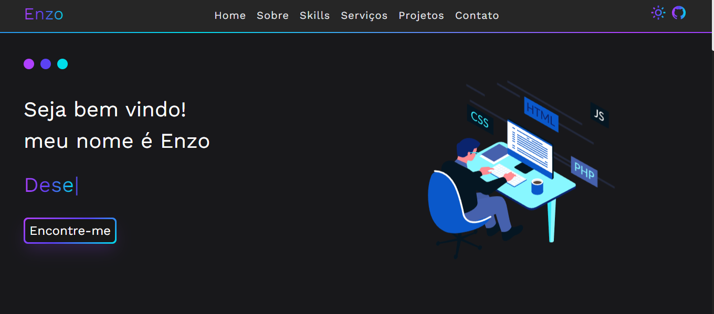

<h1 align="center">
  💻 <a href="https://portfolio-enzosylvestrin.vercel.app">Portfólio - Enzo Sylvestrin</a>
</h1>

<h4 align="center"><a href="https://portfolio-enzosylvestrin.vercel.app">Clique para visitar o projeto</a></h4>

## 📚 Seções

O site é composto por sete seções:

- **Home:** Apresentação inicial;
- **Sobre:** Descrição dizendo um pouco sobre quem eu sou;
- **Skills:** Seção que mostra as minhas habilidades;
- **Serviços:** Exibe através de cards os diferentes serviços em que possuo conhecimentos;
- **Projetos:** Apresenta alguns projetos desenvolvidos e com link direto para os respectivos códigos no GitHub;
- **Contato:** Formas de entrar em contato comigo, incluindo um formulário para me enviar um email;

## 🙃 Funcionalidades extras

- No menu o usuário consegue alterar o tema clicando no ícone da lua ou do sol;
- É possível alterar a cor do degradê do site, clicando sobre as cores na tela inicial.

---

## 💼 Tecnologias utilizadas

Algumas das tecnologias utilizadas para o desenvolvimento foram:

- HTML;
- CSS;
- Tailwindcss;
- TypeScript;
- Next;
- Framer motion;

---

<h2>👻 Autor</h2>

<table>
  <tr>
    <td align="center">
      <a href="https://github.com/EnzoSylvestrin">
         
        
          <b>Enzo Sylvestrin</b>
        
      </a>
    </td>
  </tr>
</table>
